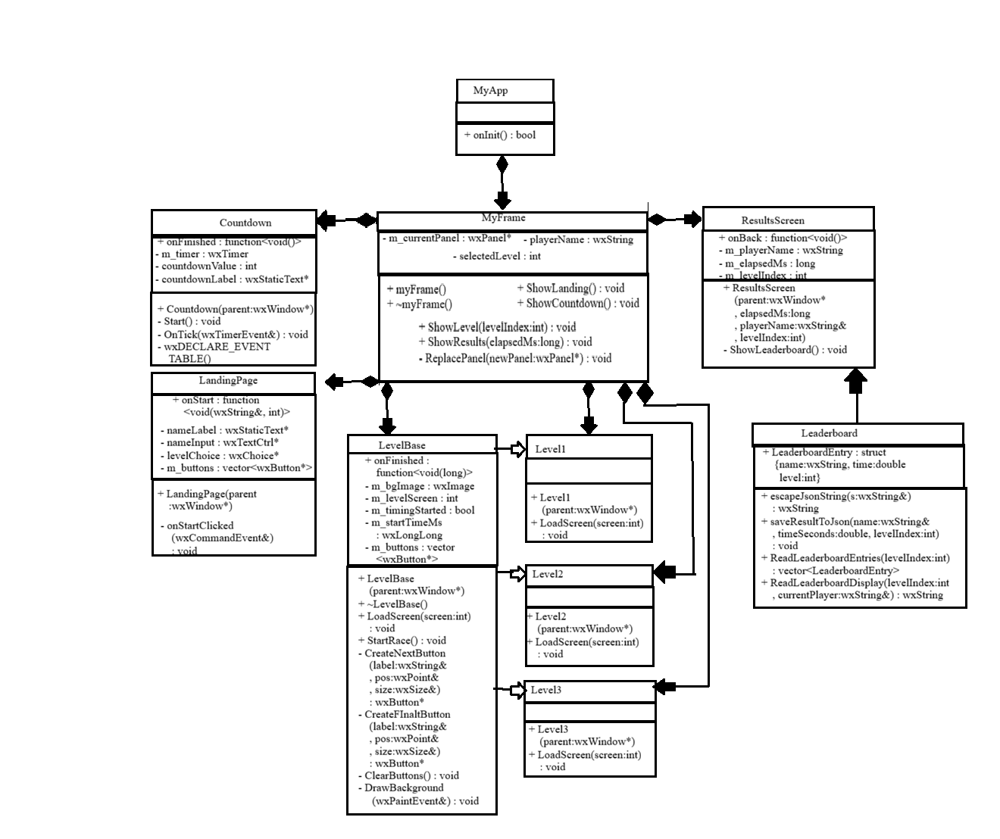

# FootyTrends - REGISTRATION GAME
**Authors:**  Will Kershner, Cameron Barrett, Pedro Octavio, Jedges Gyasi
**Date:** December 08, 2025

## Program Description

A wxWidgets-based simulation game that mimics the URichmond bannerweb class registration experience. Players race against time to complete registration tasks while facing increasingly difficult challenges. 

### Features

**Three Difficulty**

-   Level 1

> Easiest level. User gets to plan classes and hit submit. Simulating a “normal” day of registration.

- Leve 2

> User needs to add each class individually to their plan and then click submit
The “add all” from plan button is not included.


- Level 3

> The  user will encounter WIFI, loading screen errors.
Either will take between 3-10 seconds until the user can continue: either showing a loading screen or turning off their wifi.

---

## Program UML


## How to Compile and Run

### Compilation
Using the provided Makefile:
```bash
make 
```

and to clean all executables and object files.
```bash
make clean
```
clean_after to remove all object file adn keep game executable file.

```bash
make clean_after
```


### Running the Program
```bash
./game
```

**Note:** Ensure all Json and png files are in the same directory as the executable.

---


## WxWIdget Installation

# Download wxWidgets

Follow the instructions on the official wxWidgets website to download and install wxWidgets for your operating system: [wxWidgets Download](https://www.wxwidgets.org/downloads/)

## A sample submit page

> [Game Submit](assets/Level1/submit.png)

### Level Loading page
> [Game Load](assets/Level3/loading.png)

### CITE
1. Chat for debugging loadfile for  menthods and linker errors